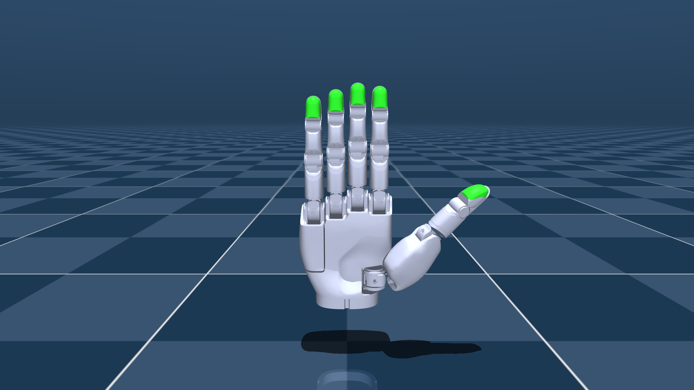

# Sharpa Wave Description (MJCF)

> [!IMPORTANT]
> Requires MuJoCo 3.1.6 or later (for the `dampratio` attribute on position
> actuators).

## Changelog

See [CHANGELOG.md](./CHANGELOG.md) for a full history of changes.

## Overview

This package contains a simplified robot description (MJCF) of the **Sharpa
Wave** five-fingered tactile hand developed by
[Sharpa Robotics](https://www.sharpa.com/). The hand has 22 degrees of
freedom across the thumb (5 DoF), index/middle/ring fingers (4 DoF each), and
pinky (5 DoF), and integrates Sharpa's
[fingertip tactile sensors](https://www.sharpa.com/pages/wave) modelled here
as the green elastomer pads on each distal phalange. Both left- and
right-handed versions are provided.

The model is derived from the URDF and assets published at
[sharpa-robotics/sharpa-urdf-usd-xml](https://github.com/sharpa-robotics/sharpa-urdf-usd-xml)
(commit
[`6eea427eb24189519f32b9f21674cd534d3f973c`](https://github.com/sharpa-robotics/sharpa-urdf-usd-xml/commit/6eea427eb24189519f32b9f21674cd534d3f973c)).

<p float="left">
  
</p>

## URDF → MJCF derivation steps

### Left Hand

1. Added the following `<mujoco>` block to `left_sharpa_wave.urdf`'s `<robot>`
   clause to preserve visual geometries and prevent the wrist link from being
   fused into the world:

    ```xml
    <mujoco>
      <compiler meshdir="meshes" balanceinertia="false"
                discardvisual="false" fusestatic="false"/>
    </mujoco>
    ```

2. Loaded the URDF into the MuJoCo viewer and saved a corresponding MJCF:

    ```bash
    python -m mujoco.viewer --mjcf=left_sharpa_wave.urdf
    ```

3. Extracted common properties into the `<default>` section, organised under a
   `sharpa` parent class:
   - `visual` / `collision` for geom appearance and contact settings.
   - `elastomer_visual` / `elastomer_collision` for the fingertip tactile
     pads. The `elastomer_collision` class uses a softer `solref="0.06 0.9"`
     to approximate the silicone pad compliance.
   - `CMC_joint` / `PCMC_joint` / `MCP_joint` / `PIP_joint` / `DIP_joint`
     carrying `armature`, `damping`, `frictionloss`, and `actuatorfrcrange`
     values specific to each joint class, matched to the Sharpa controller
     specs.

4. Replaced the auxiliary massless fingertip link (a TCP marker in the URDF)
   with a `<site>`, then resaved with `fusestatic="true"`. `fusestatic` merges
   every jointless, non-mocap body into its parent, carrying geoms, sites, and
   inertia along, so the per-finger elastomer-pad and fingertip links collapse
   into their parent distal phalanges. This reduces the body count from 34 to
   24.

5. Generated collision geometry:
   - Capsules auto-fit to the visual mesh of each finger phalange (CMC_VL,
     MCP_VL, PP, MP, DP).
   - 32-piece VHACD convex decomposition of the palm.
   - Fingertip capsules assigned to the `elastomer_collision` class so contact
     on the tactile pads uses the compliant solver reference.

6. Added 22 position-controlled actuators (one per joint), inheriting their
   control range from the joint range via `inheritrange="1.0"`.

7. Added `<exclude>` clauses to prevent contact between adjacent links of the
   same finger and between the palm and proximal links.

8. Set `<option integrator="implicitfast" impratio="10" cone="elliptic"/>`.

9. Added a `wrist_site` at the base of the hand for mounting onto wrist or
   arm models.

### Right Hand

Generated from `left_hand.xml` by [`make_right.py`](./make_right.py)
(`uv run make_right.py`; deps are declared inline via PEP 723). The upstream
`right_sharpa_wave.urdf` is authored independently of the left and uses
divergent body-frame conventions, so it is not used here. The script:

- Mirrors all 56 meshes from `assets/left/` into `assets/right/` (Y-flip
  vertices, reverse winding) and renames `left_*` files to `right_*`.
- Reflects the body tree through `M_y = diag(1, -1, 1)`, mirroring `pos`,
  `quat`, `ipos`, `iquat`, geom/site poses, joint `axis`, and joint `range`
  (negated and swapped, since `R(a, θ) = R(-a, -θ)`).
- Repoints `meshdir` and renames every `left_` identifier to `right_`.

The result is verified two ways at qpos=0. `right_hand.xml` is a clean
Y-mirror of `left_hand.xml`, with all world-frame quantities within
tolerance. It also agrees physically with the upstream
`right_sharpa_wave.urdf`, where fingertip positions and joint anchors match
to ~1 µm and joint axes to float precision, even though that URDF uses
divergent body-frame conventions.

## Known issues

- **`thumb_DP` mass.** The upstream URDFs disagree on the thumb distal
  phalange mass (`left_sharpa_wave.urdf`: 0.00988 kg, `right_sharpa_wave.urdf`:
  0.00788 kg). This package uses 0.00998 kg on both hands. The spread is below
  grasp-relevant accuracy but should be reconciled against the physical part.

## License

These models are released under an [Apache-2.0 License](LICENSE).
